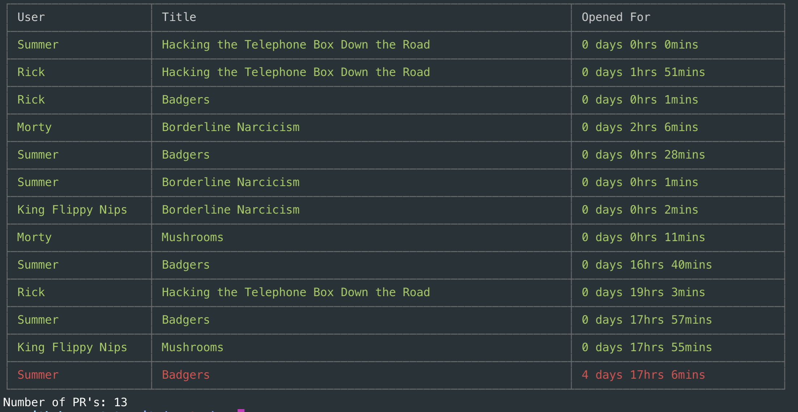

# github-pr-stats

Github Pull Request Stats Y'All

Generate stats for the last 14 days (or whatever):


Generate stats regarding open pull requests:




Create a file called config.json in the root with the following structure and creds:

```
{
    "apikey": "",
    "org": "",
    "repo": ""
}
```